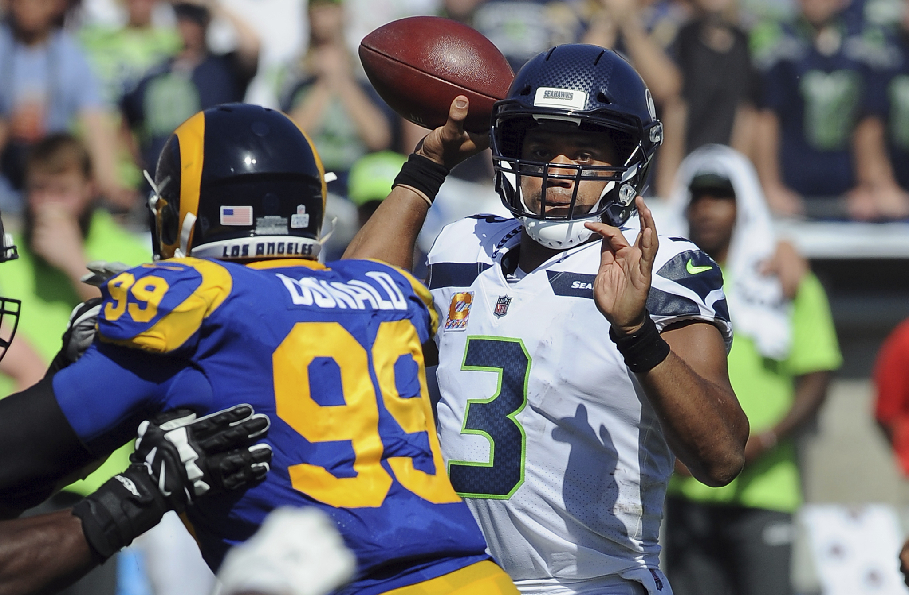

# Lecture-12-Exercise
# Jared and Brian's plan to pass INFO 201

Near the end of the week, Brian and Jared realize that they have to combine their skills in order to complete their **Lecture 12 Exercise**. They need to have _the ability to know how to create a repository_, _add collaborators_, _make changes to the README.md file, and push it all to GitHub_. With being able to do these tasks, they will be able to still be on track to pass their INFO 201 class.

For breakfast Jared ate rice and pork with milk.

# Our info 200 project summary
For our info 200 project we decided to work on designing an app that shows available covid-19 testing centers.

# Brian's Sunday Thoughts on Russell Wilson and the Seahawks
> One would think with the streak Russell Wilson has been on that he would continue his dominance week in and week out. However, these past few weeks have been rough on him as his turnover ratio is continually increasing and his team has lost in back to back weeks. These events have created many Seahawks fan, such as myself, to become stressed and have anxiety for future weeks to come.

 This [article](https://www.pennlive.com/sports/2020/11/seattle-seahawks-vs-los-angeles-rams-free-live-stream-111520-how-to-watch-nfl-games-time-channel.html) captures Russell Wilson looking for a opening to pass, as defenders come rushing in. Throughout the game, the defense continues to send pressure, leading to him having a two interception game:
 

# Jared's plans next quarter
Jared plans on doing INFO 340, LING 200, and PHIL 120 next quarter. He plans on taking it because it fills up his VLPA credits and also he's kind of interested in those classes.

# jared's old a1 assignment
